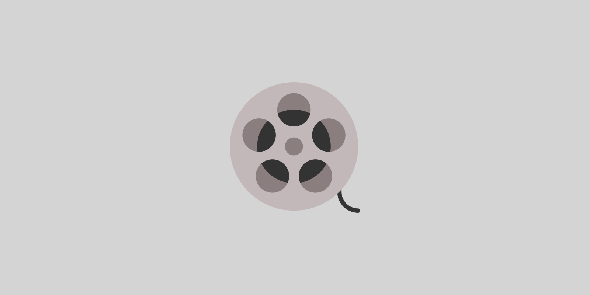

# Movie Catalog

Movie Catalog was developed using MongoDB, Express.js, React.js and Node.js.



## Installation

Clone repository and install node modules:

```
$ git clone <repository url> <folder name>
$ cd <folder name>/client
$ npm i
$ cd ../server
$ npm i
```

## Configuration

You have to modify a few files for your environment.

At first, you have to modify `server/config/default.json`.

And maybe you have to modify the following line in `client/package.json`:

```
"proxy": "http://localhost:5000"
```

## Execution

Run server-side and client-side parts of the project:

```
$ cd server
$ npm start
```

If you want to display debug-messages, set environment variable `DEBUG`:

```
$ DEBUG=app:* npm start
```

## Testing

You can run a few tests for server-side part of the project.

Tests are located in `server/test` folder. You can run them with the following command:

```
$ npm test
```

## Movie

### Structure

Field|Data Type|Required|Restrictions
:-----|:-----|:-----|:-----
`title`|String|Required|No longer than 100 characters
`year`|Number|Required|No less than 1800 and no more than 3000
`format`|String|Required|`VHS` or `DVD` or `Blu-Ray`
`stars`|Array of Strings|Required|Each string is no longer than 100 characters and at least one string must be present

### Schema

```
const Movie = new mongoose.model('Movie', new mongoose.Schema({
    title: {
        type: String,
        required: true,
        maxlength: 100
    },
    year: {
        type: Number,
        required: true,
        min: 1800,
        max: 3000
    },
    format:  {
        type: String,
        required: true,
        enum: formats
    },
    stars: {
        type: [{
            type: String,
            maxlength: 100
        }],
        required: true
    }
}));
```

### Server-Side Data Validation

Joi module is used to validate data on the server.

```
const validate = (movie) => {
    const schema = {
        title: Joi.string().max(100).required(),
        year: Joi.number().min(1800).max(3000).required(),
        format: Joi.string().valid(formats).required(),
        stars: Joi.array().items(Joi.string().max(100)).min(1).required()
    };

    return (Joi.validate(movie, schema));
};
```

### Client-Side Data Validation

Form validation is used to validate input on the client-side.


## Architecture

### Server

Express.js is used for handling http-requests.

Mongoose is used for work with MongoDB.

#### RESTful API

URL|HTTP Method|Body of Request|Response
:-----|:-----|:-----|:-----
`/api/movies`|`GET`|—|All movies
`/api/movies?title=<title>`|`GET`|—|All movies that match `<title>`
`/api/movies?star=<star>`|`GET`|—|All movies which stars list contains `<star>`
`/api/movies`|`POST`|JSON|Created movie
`/api/movies/upload`|`POST`|File|All created movies
`/api/movies/:id`|`DELETE`|—|Deleted movie

### Client

React.js, Redux and Bootstrap are used to create client-side part of Movie Catalog.


